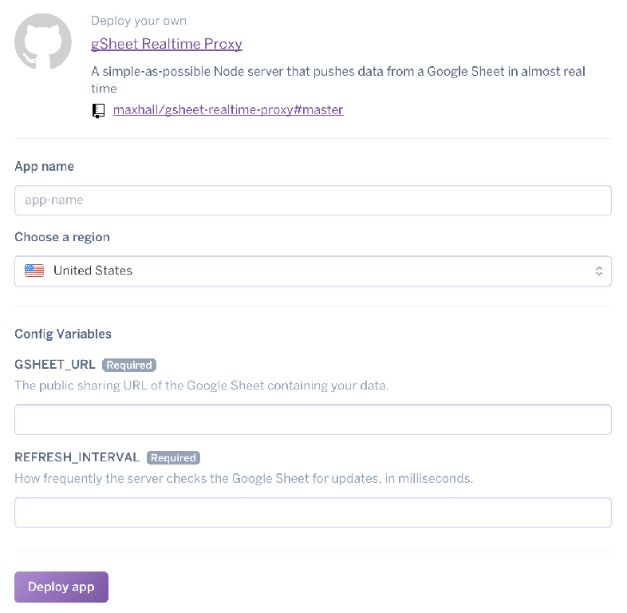

# Tiny gSheet real-time proxy

A simple-as-possible [Node](#) server that uses [Sheetsy](#) and [Socket.io](#) to push data from a Google Sheet in almost real time.

This project was created for [Honi Soit's 2017 election coverage](#).

There are two ways of deploying this project. Which you choose depends on what structure you want your spreadsheet data to have when it reaches your client. By default the server sends a Javascript object containing one object for each sheet of the source Google Sheet. If you're okay with this (and it's probably fine) then follow the simple deployment steps. Otherwise you will want to modify the source before deploying and you should follow the more involved custom deployment.

## Simple deployment: straight to Heroku

1. I'm assuming you have a spreadsheet of data you want to use. Follow the guidelines [here](https://github.com/TehShrike/sheetsy#how-to-set-up-your-google-spreadsheet) about setting up your spreadsheet and getting the public URL we will need.

2. Hit this "Deploy to Heroku" button.

[](https://heroku.com/deploy)

3. Sign in to your Heroku account or follow the prompts to make one. You will be taken to a screen that looks like this:

[]

4. Give your app a name and pick a region to host it from the available options. Then all that's left to do is set the only two options we will need: the URL of the Google sheet with your source data and how frequently the server should fetch data from it, measured in milliseconds. Be careful not to go too low for the Refresh Interval. Google is known to arbitrarily block people polling their servers too much.

5. Press "Deploy app". Watch it build the app. Check the logs in Heroku's management dashboard. If you're URL doesn't seem to be working, follow [these steps](https://github.com/jsoma/tabletop#if-your-publish-to-web-url-doesnt-work).

6. That should be it. Make sure to point you socket.io client to the server when you work on that. This will usually look something like `var socket = io('https://test-streaming-server.herokuapp.com/');`. The testClient.html file in this repository has a minimal client for testing purposes you might want to play with.

### Running costs

Heroku gives you 550 free server hours a month for free, and an additional 450 if you register with a credit card. That should be plenty for most projects using this.

## Deploying with modification (draft)

This can be deployed anywhere you can run a Node app, but is particularly easy to get working with Heroku.

1. Install everything locally

I'm assuming you have [Node](#) and [Heroku](#) installed. If you don't, hit those links and follow the instructions.

You will also need a Google Sheet shared publicly. The server uses [Tabletop](#) to pull data from Google Sheets. Follow the instructions [here](#) to make sure you

Clone this repository to your computer and install all your dependencies.

```sh
$ git clone https://github.com/maxhall/gsheet-socket-server.git my-project-name
$ cd my-project-name
$ npm install
```

2. Set up local variables

The server no interface. We set two options—the URL of the Google sheet with your source data and how frequently the server should fetch data from it—using environment variables.

3. Clean up your data

The Javascript object Tabletop pulls from you Google Sheet will contains a fairly large amount of useless data. You should only send data you actually need to the client, so we define a `processData` function that takes the full Google Sheet object as an argument and returns a clean Javascript object of the data you want to reach the client with whichever structure makes your life easiest.

The function's default behaviour returns an object containing one object for each sheet of the source Google Sheet. If this isn't the behaviour you want, edit the function.

4. Deploying to Heroku

## Client

Use the Socket.io client side library to subscribe to the processed data.

This can be as simple as linking the library in your head tag and inserting the following before the end of your body tag.

```
Client-side code snippet.
```

Each time the spreadsheet update your client receives a fresh old object. Everything from their is up to you.

A full example of this

## Retiring your server

When your live data comes to an end, you might want to preserve the final state of your project without continuing to run the server.
